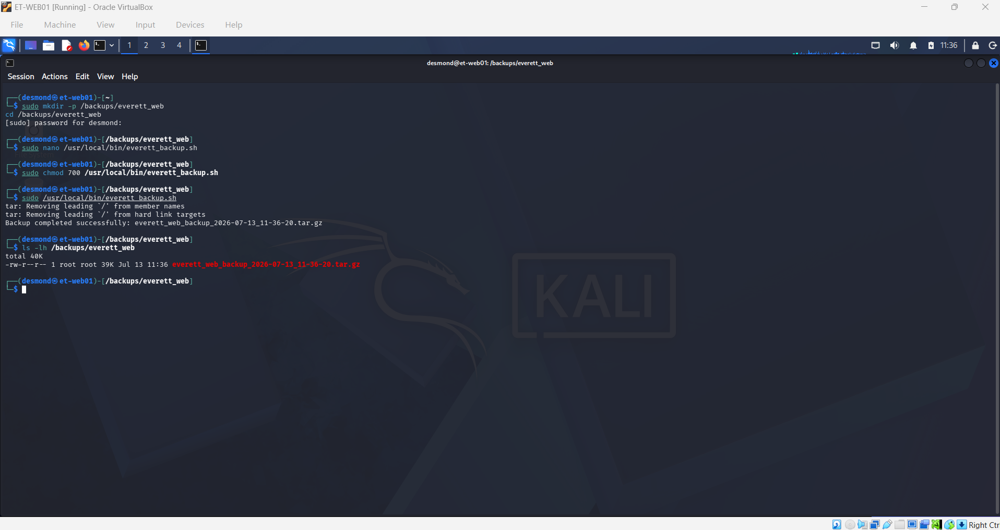
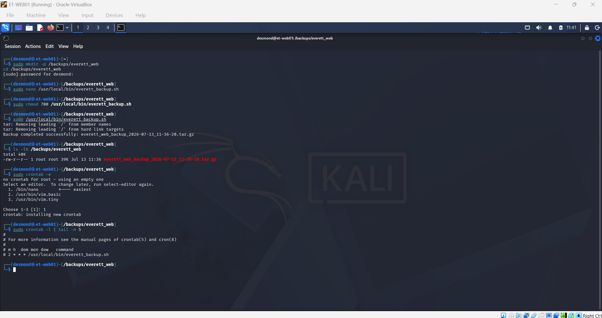

# Lab 3: Automated Server Backups (Bash & Cron)

## 📖 Scenario
With the *Everett Technologies* web application and backend database now live in production, a disaster recovery strategy is critical. This phase involves engineering a custom Bash script to automatically archive the web directory and web server configurations, and scheduling it to run nightly using the Linux `cron` daemon to ensure data resilience.

## 🎯 Objectives
- Provision a dedicated, secure directory for local backup storage.
- Develop a Bash script to compress (`tar.gz`) the `/var/www/html` and `/etc/apache2` directories with dynamic timestamping.
- Modify script permissions to allow execution.
- Schedule an automated nightly backup task using `crontab`.

## 🛠️ Execution Steps

### Phase 1: Storage Provisioning
Create a dedicated directory for the backups and navigate into it.
```bash
sudo mkdir -p /backups/everett_web
cd /backups/everett_web
```

### Phase 2: Developing the Bash Script
Create the automation script using the nano text editor.
```bash
sudo nano /usr/local/bin/everett_backup.sh
```

*Paste the following code into the script:*
```bash
#!/bin/bash

# Everett Technologies: Nightly Web Backup Script
# Archives the web root and Apache configurations

BACKUP_DIR="/backups/everett_web"
TIMESTAMP=$(date +"%Y-%m-%d_%H-%M-%S")
ARCHIVE_NAME="everett_web_backup_$TIMESTAMP.tar.gz"

# Create the compressed tarball
tar -czf $BACKUP_DIR/$ARCHIVE_NAME /var/www/html /etc/apache2

# Optional: Delete backups older than 7 days to save disk space
find $BACKUP_DIR -type f -name "*.tar.gz" -mtime +7 -exec rm {} \;

echo "Backup completed successfully: $ARCHIVE_NAME"
```

### Phase 3: Securing and Testing the Script
Make the script executable, restrict permissions so only root can modify it, and run a manual test.
```bash
sudo chmod 700 /usr/local/bin/everett_backup.sh
sudo /usr/local/bin/everett_backup.sh
ls -lh /backups/everett_web
```

### Phase 4: Scheduling the Cron Job
Open the crontab for the root user to schedule the automation.
```bash
sudo crontab -e
```

*Add this line to the very bottom of the crontab to schedule the backup to run daily at 2:00 AM:*
```bash
0 2 * * * /usr/local/bin/everett_backup.sh
```

---

## 🧠 Lessons Learned & Troubleshooting

During the development of this automation, a key principle of system administration was reinforced:

### The Cron Environment & Absolute Paths
- **Concept:** When writing Bash scripts, a common pitfall is assuming the script will run in the same environment as your user terminal. 
- **Application:** The `cron` daemon executes jobs in a highly restricted, non-interactive shell with a minimal `$PATH`. If standard commands (like `tar` or `find`) or directory paths are not explicitly defined, the script might run perfectly when tested manually but fail silently when triggered by cron. 
- **Resolution:** To engineer a robust script, **absolute paths** were utilized for all target directories (`/var/www/html`, `/etc/apache2`, and `/backups/everett_web`), and the script itself was placed in `/usr/local/bin/` and called by its absolute path in the crontab.

---

## 📸 Verification & Screenshots

**1. Successful Archive Creation**


**2. Active Cron Job Schedule**

