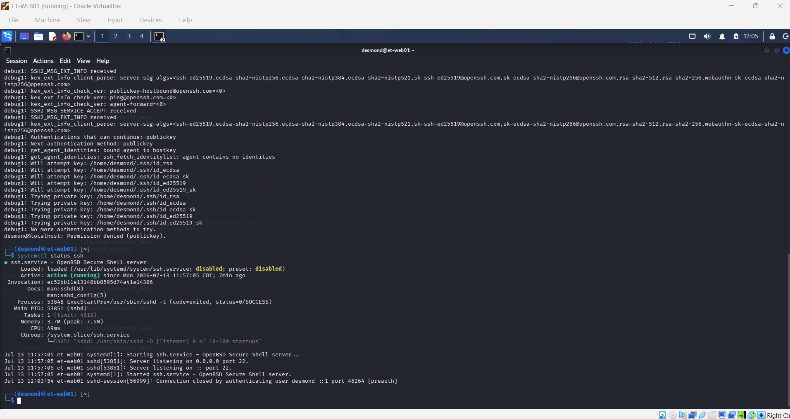
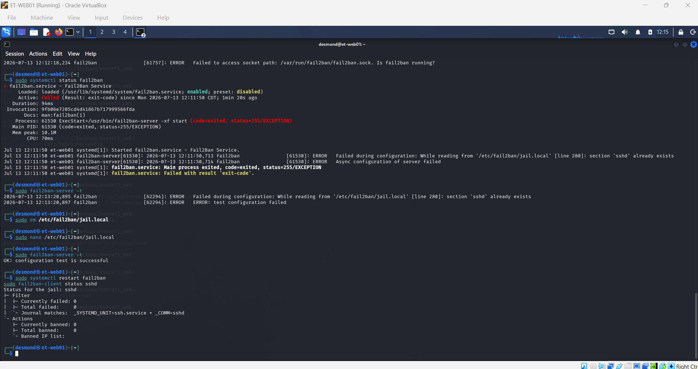

# Lab 4: SSH Hardening & Intrusion Prevention

## 📖 Scenario
With the *Everett Technologies* infrastructure fully operational, securing the perimeter against automated brute-force attacks is the highest priority. This phase hardens remote administration access by enforcing cryptographic SSH key-pair authentication and deploying Fail2ban to actively monitor logs and ban malicious IP addresses.

## 🎯 Objectives
- Enforce strict directory permissions on SSH configuration files.
- Modify the `sshd_config` file to disable root login and enforce key-only access (disabling passwords).
- Install and configure Fail2ban to protect the SSH daemon.
- Verify security policies by checking active Fail2ban jails and observing authentication rejections.

## 🛠️ Execution Steps

### Phase 1: SSH Key Generation & Server Configuration
*(Note: Key generation is executed on the local client machine. The public key is then transferred to the server's `~/.ssh/authorized_keys` file. Assuming the key is in place, we proceed to harden the server's backend.)*

Ensure the SSH directory has the correct strict permissions before locking down the service:
```bash
chmod 700 ~/.ssh
chmod 600 ~/.ssh/authorized_keys
```

### Phase 2: Hardening the SSH Daemon
Edit the core SSH configuration file to disable passwords and root access.
```bash
sudo nano /etc/ssh/sshd_config
```

*Locate and update the following directives to match these exact values:*
```bash
PermitRootLogin no
PasswordAuthentication no
PubkeyAuthentication yes
```

Restart the SSH service to apply the new security rules:
```bash
sudo systemctl restart ssh
```

### Phase 3: Installing & Configuring Fail2ban
Install the intrusion prevention system to actively block brute-force attempts.
```bash
sudo apt install fail2ban -y
```

Create a local configuration copy (to prevent system updates from overwriting your custom rules) and open it for editing:
```bash
sudo cp /etc/fail2ban/jail.conf /etc/fail2ban/jail.local
sudo nano /etc/fail2ban/jail.local
```

*Ensure the `[sshd]` jail is enabled and configure the ban parameters (e.g., 5 retries triggers a 1-hour ban):*
```ini
[sshd]
enabled = true
port    = ssh
logpath = %(sshd_log)s
backend = %(sshd_backend)s
maxretry = 5
bantime = 3600
```

Enable and start the Fail2ban service:
```bash
sudo systemctl enable fail2ban
sudo systemctl restart fail2ban
```

### Phase 4: Service Verification
Check the status of the SSH jail to ensure Fail2ban is actively monitoring for threats.
```bash
sudo fail2ban-client status sshd
```

---

## 🧠 Lessons Learned & Troubleshooting

During the SSH hardening process, a critical administrative safeguard was established:

### The "Always-Open" SSH Session Rule
- **Concept:** When modifying the `/etc/ssh/sshd_config` file—specifically when disabling password authentication—there is a massive risk of permanently locking yourself out of the server if the SSH keys were not properly configured or permissions were slightly off.
- **Application:** Before running `sudo systemctl restart ssh` to apply the hardened rules, **always keep your current, active SSH session open**. Open a completely separate terminal window and attempt to log in using the new key-pair method.
- **Resolution:** If the key-pair login fails in the second window, the original terminal remains authenticated and connected. This allows you to revert the `PasswordAuthentication no` directive and troubleshoot the keys without losing administrative access to the server.

---

## 📸 Verification & Screenshots

**1. SSH Key Authentication Requirement**
*(Simulating a login attempt without the proper private key)*


**2. Fail2ban Active Jails**

