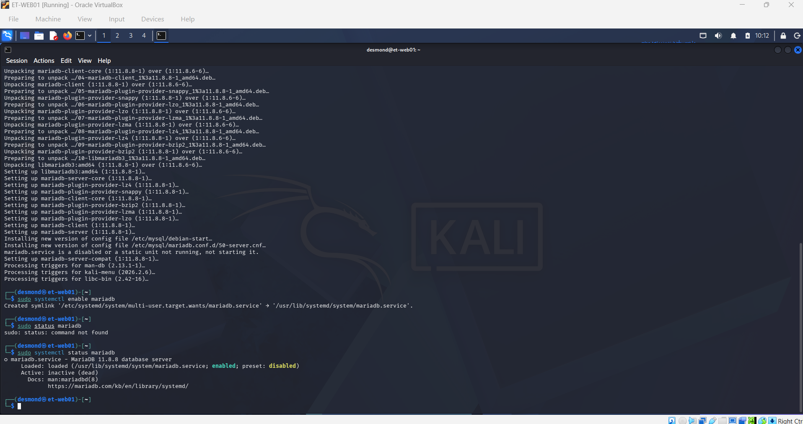
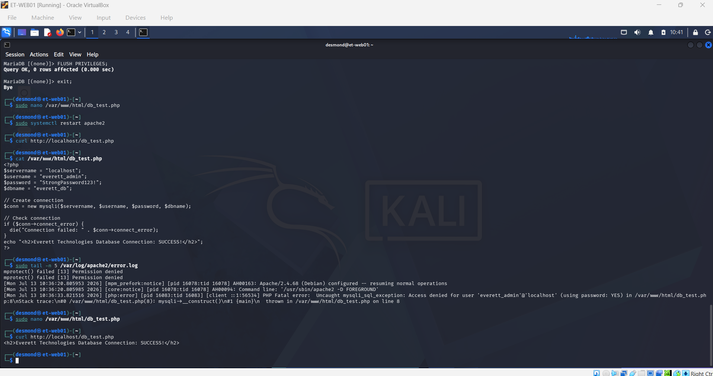
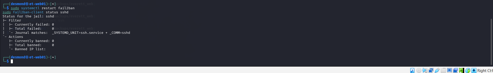

# Linux-Administration
Enterprise Linux administration portfolio featuring LAMP stack deployments, bash automation, and open-source security configurations for the simulated *Everett Technologies* corporate infrastructure.

## 🛠️ Linux Administration Lab Topology & Roadmap

### ✅ Lab 1: Enterprise Web Server (LAMP Stack)
- **Status:** ✅ Completed
- **Documentation:** [View Lab Documentation](./Labs/Lab-01-Enterprise-Web-Server.md)
- **Description:** Provisioning a Debian-based Linux server, configuring an Apache web server, and securing the perimeter with UFW (Uncomplicated Firewall) to host Everett Technologies' external assets.

#### 📸 Lab 1 Verification
**1. Apache Service Verification**

**2. UFW Active Ruleset**

**3. Everett Technologies Landing Page**

---

### ✅ Lab 2: Database Integration (MariaDB/MySQL)
- **Status:** ✅ Completed
- **Documentation:** [View Lab Documentation](./Labs/Lab-02-Database-Integration.md)
- **Description:** Securing and configuring a backend MariaDB database for Everett Technologies' web applications, including service account creation and PHP connectivity testing to complete the LAMP stack.

#### 📸 Lab 2 Verification
**1. MariaDB Service Status**

**2. PHP Database Connectivity Test**

---

### ✅ Lab 3: Automated Server Backups (Bash & Cron)
- **Status:** ✅ Completed
- **Documentation:** [View Lab Documentation](./Labs/Lab-03-Automated-Server-Backups.md)
- **Description:** Developing custom Bash scripts to archive `/var/www/html` and Apache configurations, scheduled via cron jobs for automated nightly disaster recovery.

#### 📸 Lab 3 Verification
**1. Successful Archive Creation**

**2. Active Cron Job Schedule**

---

### ✅ Lab 4: SSH Hardening & Intrusion Prevention
- **Status:** ✅ Completed
- **Documentation:** [View Lab Documentation](./Labs/Lab-04-SSH-Hardening-&-Intrusion.md)
- **Description:** Hardening remote access by enforcing SSH key-pair authentication and deploying Fail2ban to actively mitigate automated brute-force attacks against the server.

#### 📸 Lab 4 Verification
**1. SSH Key Authentication Requirement**

**2. Fail2ban Active Jails**

---

## 📁 Repository Directory Structure
- **/Labs** — Step-by-step markdown documentation, lessons learned, and verification walkthroughs.
- **/Screenshots** — Visual proof of successful command outputs, bash scripts, and system configurations.
